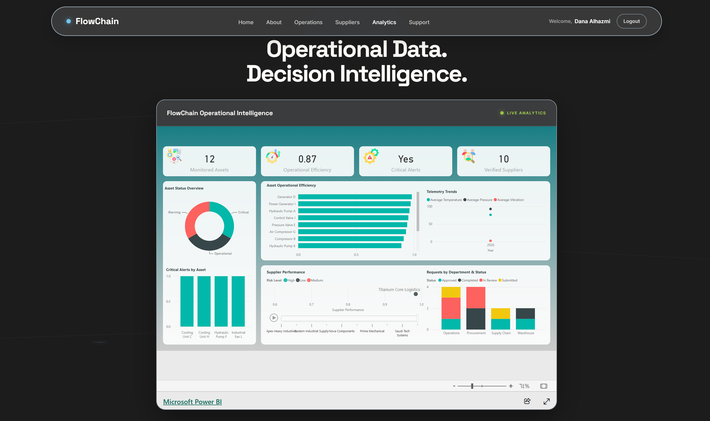
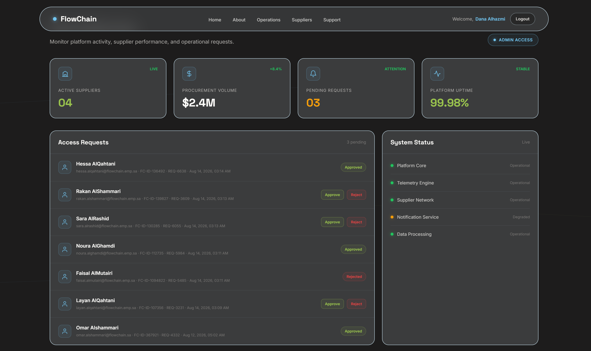
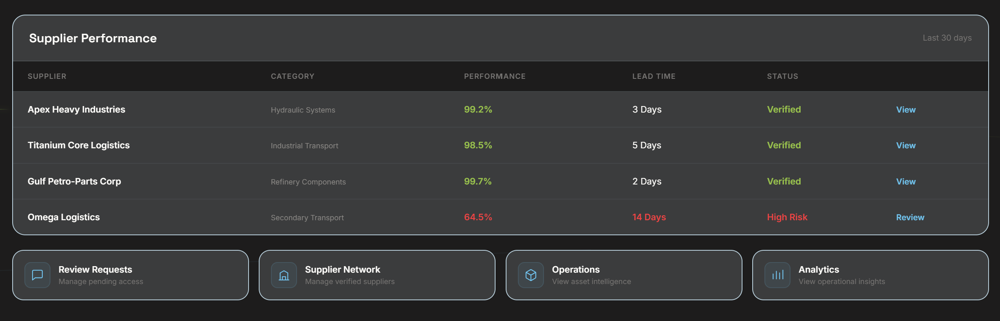

# FlowChain
### Industrial Operations & Supply Chain Intelligence Platform

🌐 **Live Demo:** https://danalhazmi.github.io/FlowChain-Industrial-Operations-Supply-Chain-Intelligence/

> **Connect the operation. Understand the data. Enable the decision.**

FlowChain is a connected Industrial Operations & Supply Chain Intelligence platform designed to demonstrate how operational data, workflows, access governance, and analytics can work together within a single ecosystem.

Instead of treating assets, suppliers, requests, users, and analytics as isolated components, FlowChain connects them into a unified operational concept that supports operational visibility, workflow management, governance, and data-driven decision-making.

---

# 🚀 Project Overview

In industrial environments, operational information is distributed across multiple areas such as:

- Assets
- Suppliers
- Maintenance
- Operational Requests
- Telemetry
- User Identity
- Access Permissions
- Performance Data

When these elements operate separately, understanding the complete operational picture becomes more difficult.

**FlowChain addresses this concept by connecting these layers into one system.**

The platform follows the movement of information from:

**User → Access → Operations → Workflow → Data → Analytics → Decision**

---

# 🎯 Project Vision

FlowChain was built around one core question:

> **What if the problem is not a lack of data, but the fact that data, operations, and decisions are disconnected?**

The goal was not to create a traditional website with isolated pages, but to design a **Connected Operational System** that demonstrates how different organizational processes can interact within the same ecosystem.

---

# 🧩 Core System Layers

FlowChain is structured around three connected layers.

## 1. Operational Layer

Responsible for operational visibility and workflow management.

Includes:

- Asset Intelligence
- Supplier Management
- Operational Requests
- Maintenance Tracking
- Telemetry
- Operational Workflows

## 2. Governance Layer

Responsible for controlling **who can access the platform and what they are authorized to access**.

Includes:

- Identity Verification
- Access Requests
- Access Approval / Rejection
- Role-Based Access Control (RBAC)
- Session Management
- Admin Control Center
- User Management

## 3. Analytics Layer

Transforms operational data into executive-level insights.

Includes:

- Power BI
- KPIs
- Trends
- Performance Analysis
- Operational Insights
- Decision Intelligence

---

# 🔐 Access Governance & Protected Areas

FlowChain intentionally separates the public operational experience from protected administrative and analytical capabilities.

The platform follows a **Role-Based Access Control (RBAC)** approach, ensuring that users only receive access to the capabilities associated with their authorization level.

The access model follows:

**Identity → Authentication → Authorization → Role → Access**

---

# 🌐 Public Operational Experience

The public operational experience allows users to explore the main capabilities of the platform, including:

- Home
- About
- Operations
- Asset Intelligence
- Suppliers
- Operational Requests
- Support

These areas represent the operational side of FlowChain and are available as part of the standard platform experience.

---

# 🔒 Protected Administrative & Analytics Experience

Certain areas of FlowChain are intentionally protected and are **not accessible to regular users when they enter the platform**.

These protected areas are restricted to authorized administrators based on their assigned role and permissions.

Protected modules include:

- Analytics
- Power BI Executive Dashboard
- Admin Control Center
- Access Request Management
- User Management
- Identity Verification
- Access Approval / Rejection

These modules demonstrate how FlowChain applies access governance instead of exposing every system capability to every user.

> **The screenshots below are visual previews of protected modules. They are included to demonstrate the design and functionality of these areas, but the actual modules remain restricted to authorized administrators.**

---

# 📊 Restricted Analytics Dashboard

The Analytics module and Power BI Executive Dashboard are protected and are not accessible to regular users when they enter the platform.

These areas are restricted to authorized administrators only.

The dashboard transforms operational information into decision-oriented insights across areas such as:

- Operational KPIs
- Asset Intelligence
- Supplier Performance
- Request Analysis
- Telemetry Insights
- Performance Trends
- Decision Intelligence

### Analytics Preview



The dashboard represents the final stage of the FlowChain information lifecycle:

**Operational Data → Analytics → Insight → Decision**

The screenshot above is provided as a visual preview of the protected analytics experience.

---

# 🛡️ Admin Control Center

The Admin Control Center is a protected area restricted to authorized administrators only and is not accessible to regular users when they enter the platform.

It provides administrative capabilities such as:

- Reviewing access requests
- Verifying employee information
- Approving accounts
- Rejecting access requests
- Managing users
- Controlling system access
- Managing authorized roles

### Admin Dashboard Preview



### Access Management Preview



The screenshots above demonstrate the design and functionality of the protected administrative interface.

The Admin Control Center demonstrates how identity and authorization can be managed as part of the same operational ecosystem rather than being treated as a separate process.

---

# 🏭 Asset Intelligence

FlowChain provides an operational view of monitored assets instead of treating them as static records.

Asset information includes:

- Asset ID
- Asset Name
- Category
- Location
- Status
- Efficiency
- Critical Alerts
- Maintenance Due

Users can navigate into **Asset Details** to view more detailed operational information.

---

# 🤝 Verified Supplier Network

Suppliers are evaluated through operational and risk-related indicators rather than simply being displayed in a list.

Supplier information includes:

- Supplier ID
- Supplier Name
- Category
- Contract Status
- Lead Time
- Performance
- Risk Level

This allows users to identify suppliers that are performing reliably and suppliers that may require:

**Review → Intervention → Monitoring**

---

# 📋 Operational Request Management

FlowChain includes an operational workflow for submitting and tracking requests.

Request categories include:

- Maintenance
- Inventory
- Supplier
- Operational Support

Requests follow a defined lifecycle:

```text
Submitted
    ↓
In Review
    ↓
Approved
    ↓
Completed
